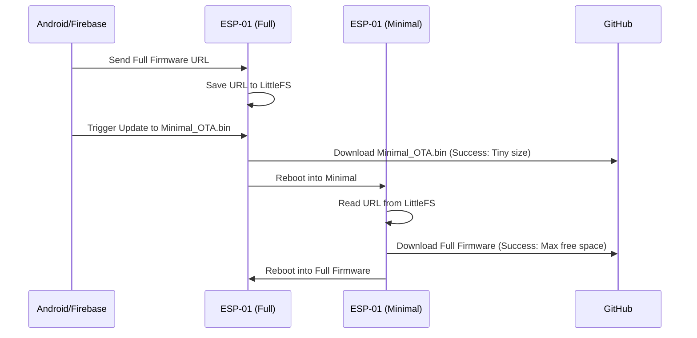

# Two-Step GitHub OTA for ESP-01 (1MB)

This plan implements a reliable two-step update process for the memory-constrained ESP-01. It uses a "Minimal Bridge" firmware to overcome the "Flash Erase Failed" error by ensuring only a tiny binary is present during the large GitHub download.

## User Review Required

> [!IMPORTANT]
> This process requires two separate `.bin` files to be compiled in your IDE.
> 1. **Minimal_OTA.bin**: Compiled from the new `Minimal_OTA.ino`.
> 2. **Kitchen_Exhaust_Fan.bin**: Compiled from the updated `Kitchen_Exhaust_Fan.ino`.

## Proposed Changes

### [ESP8266 Firmware]

#### [NEW] [Minimal_OTA.ino](file:///C:/Ananth/lib/Project/IOT_Home/ESP8266/Kitchen_Exhaust_Fan/Minimal_OTA/Minimal_OTA.ino)
- Tiny footprint (~300KB) to ensure maximum free flash space.
- Reads `ota_url.txt` from LittleFS (saved by the previous firmware).
- Performs the final HTTP/HTTPS update from GitHub.
- Includes a simple web rescue page at `http://<IP>/` if the auto-update fails.

#### [Kitchen_Exhaust_Fan.ino](file:///C:/Ananth/lib/Project/IOT_Home/ESP8266/Kitchen_Exhaust_Fan/Kitchen_Exhaust_Fan.ino)
- Update `handleRemoteOTA` to save the GitHub URL but **not** trigger a direct large update.
- Instead, it will look for a `minimal_ota.bin` (either hosted on GitHub or uploaded via web).
- **New Workflow**:
    1. Receive GitHub URL for Full Firmware -> Save to `/ota_full_url.txt`.
    2. Trigger update to `Minimal_OTA.bin`.
    3. `Minimal_OTA` boots -> Reads `/ota_full_url.txt` -> Downloads Full Firmware.

---

## Workflow Diagram

## Verification Plan

### Manual Verification
1. **Compile Minimal**: Compile `Minimal_OTA.ino` and host the `.bin` on GitHub.
2. **Trigger Step 1**: From Android/Firebase, send the URL of `Minimal_OTA.bin`.
3. **Verify Bridge**: Observe Serial logs or Web UI of ESP-01 to confirm it is running the Minimal firmware.
4. **Trigger Step 2**: From the Minimal Web UI or auto-trigger, provide the Full Firmware URL.
5. **Final Check**: Verify the device reboots back into the Full `Kitchen_Exhaust_Fan` firmware.
